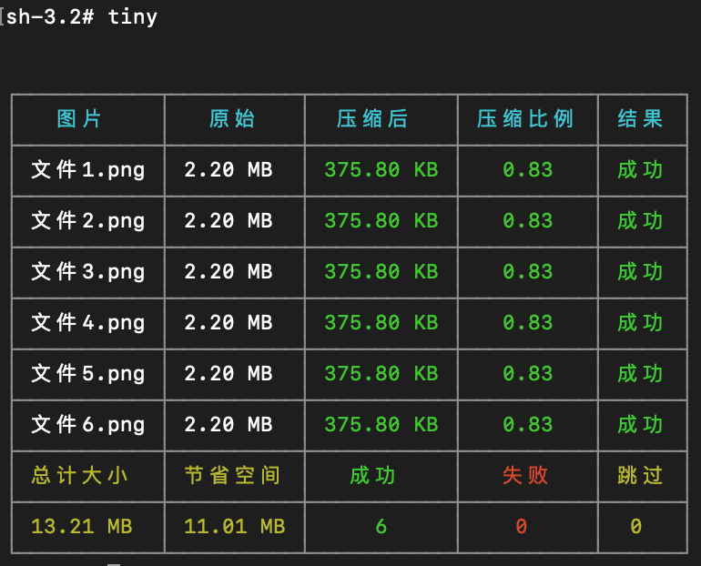

# tiny
基于tinypng的图片压缩命令行工具

## 安装
```bash
npm install -g cli-tiny
```
## 使用
```bash
tiny # 压缩当前目录
tiny -f <image> # 压缩某张图
tiny -f <imagea> to <imageb> # 压缩图片a并保存为图片b
tiny -d [dir] # 压缩某目录
tiny -d [dira] to [dirb] # 压缩目录a并保存到目录b
tiny -k <key> # 设置tiny的key
tiny -l # 查看tiny的key
tiny -c <key> # 清除tiny的key
tiny -h # 查看帮助
tiny -v # 查看版本
```

## 效果
